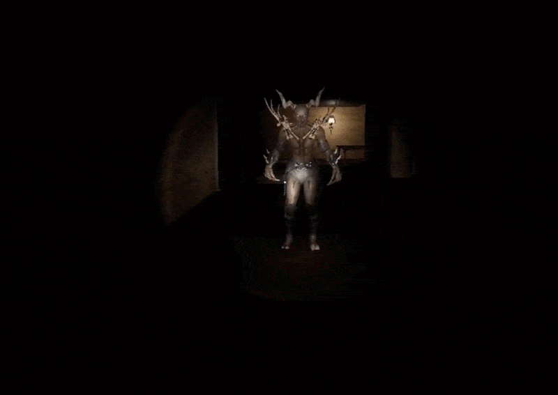
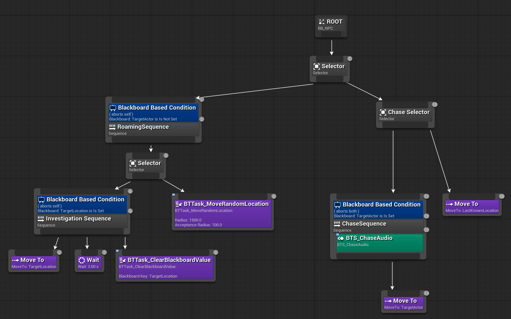
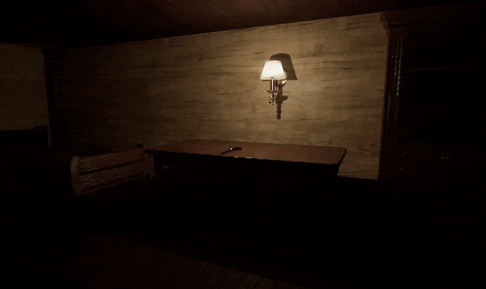

<p align="center">
  
</p>

<h3 align="left">A First-Person Horror Game — Developed with Unreal Engine 5.6</h3>

<p align="left">
  
  
  
  
  
</p>

A first-person horror game developed as a **Bachelor's Thesis Project** using **Unreal Engine 5.6**. The project focuses on delivering an atmospheric, immersive horror experience while showcasing a modular gameplay architecture using both **Blueprints** and **C++**.

---

## 🎮 About the Game

**GREED** puts the player into a dark, hostile environment where survival depends on exploration, resource management, and evading an intelligent threat.

The core objective of this project was to construct a fully functional 3D game while demonstrating key software engineering principles in Unreal Engine:
* **Hybrid C++/Blueprint Architecture:** Lower-level systems and components written in C++ for performance, extended with Blueprints for rapid gameplay iteration.
* **Complex AI Behavior:** State-driven enemy logic using Unreal Engine's Behavior Trees and AI Perception.
* **Modular Systems:** Component-based inventory, health, and object interaction pipelines.
* **Diverse Puzzle Systems:** A multitude of puzzle systems that allows progression to be dynamic and not repetitive.

---

## 🖼️ Screenshots & Visuals

### Atmosphere
<p align="left" style="display: flex; justify-content: center; gap: 15px; flex-wrap: wrap;">
  
  
</p>

### Gameplay, AI & Inventory System
<p align="left" style="display: flex; justify-content: center; gap: 15px; flex-wrap: wrap;">
  
  

  

  
</p>


---

## ✨ Features

* **First-Person Survival Horror:** Atmospheric lighting, environmental audio, and tense gameplay mechanics.
* **Advanced Enemy AI:**
  * Driven by **Behavior Trees** and **Blackboard** data storage.
  * Multi-sense detection using **AI Perception** (sight and noise reaction).
  * Dynamic state machine: `Patrol` ➔ `Investigate` ➔ `Chase` ➔ `Search/Lose Player`.
* **C++ Inventory System:**
  * Component-based (`InventoryComponent`) for reusability across entities.
  * Support for stackable items, slot management and puzzle items.
* **Interactive World:** Object interaction pipeline (pickups, doors, puzzle elements).

---

## 🚀 Getting Started

### Prerequisites

Make sure you have the following software installed before setting up the project:

* **OS:** Windows 10/11
* **Engine:** Unreal Engine 5.6
* **IDE:** Visual Studio 2022
* **VS Workloads:** Game Development with C++ & Windows SDK

---

### Installation & Setup

1. **Clone the repository:**
   ```bash
   git clone https://github.com/RomanCatalin/Licenta-Joc-Horror-Greed.git
   ```

2. **Open:**
   ```bash
    LicentaProject1.uproject
   ```
   
3. **Select the installed Unreal Engine 5.6 version if prompted.**

4. **Build the project using:**
* Development Editor
* Win64

4. **Open the project in Unreal Engine and run the game.**
